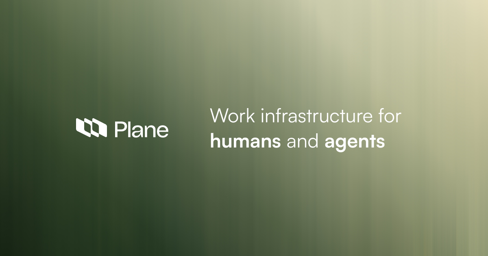
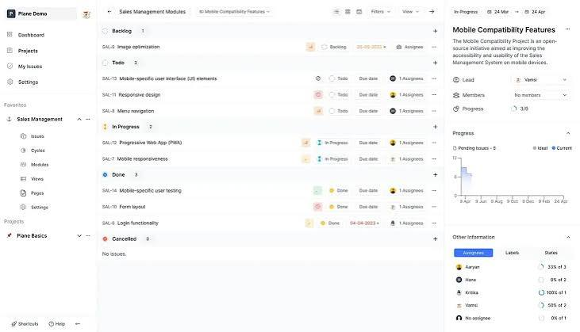
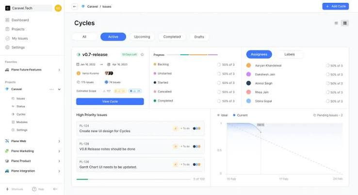

# Plane Project Management



Plane Project Management is an open source board for issues, cycles, and roadmaps. Plane Project Management Software is the same product under the longer name: lists, boards, pages, and a wiki without a second tool for notes.

This page is the handbook for that workspace. It covers plane project management self hosted, the plane project management community edition, and a plane project management docker install. You can also sign up on the hosted cloud if you do not want a box of your own.

Work items use a rich editor. Cycles replace sprints. Modules split a large project. Views save filters. Pages hold notes and can turn a line into a task. Analytics show what is stuck.

## Installation

Getting started is two paths. Cloud is a signup. Self host is compose, Kubernetes, or a one click host. Instance admins later open God mode for instance settings.

| Method | What you run |
| --- | --- |
| Cloud | Hosted workspace, no server |
| Docker | Compose file and [setup.sh](setup.sh) |
| Kubernetes | Community charts in the deploy tree |
| CLI install | [install.sh](deployments/install.sh) on a host |

The compose file in this pack is [docker-compose.yml](docker-compose.yml). Community variables sit in the deployments folder.

## Features

Plane Project Management Software tracks work items, not tickets in a vacuum.

- Work items: create a task, attach a file, add sub-properties, link related issues.
- Cycles: time boxed runs with a burn-down style chart.
- Modules: cut a large project into named chunks.
- Views: save a filter and share it.
- Pages: notes with a rich editor and optional AI assist.
- Analytics: live counts across the workspace.

The neighbor tree in this pack (Leantime) covers the same class of work: kanban, gantt, table, list, calendar, goals, wiki, timesheets, and roles. Those views are useful when you compare a plane project management self hosted box to another AGPL board.

| Area | Plane | Neighbor OSS board |
| --- | --- | --- |
| Tasks | Work items, sub-properties | Kanban, table, calendar |
| Planning | Cycles, modules | Sprints, milestones, goals |
| Knowledge | Pages | Wiki, idea boards |
| Time | Analytics | Timesheets |
| Auth | Instance admin | 2FA, LDAP, OIDC |

Cycle helpers live in [cycle.ts](utils/cycle.ts). Saved views use [views.helper.ts](helpers/views.helper.ts).



## Local development

Read the contributing file in FILES for the full flow. The monorepo uses pnpm and turbo. The web app config is [vite.config.ts](web/vite.config.ts). Workspace scripts sit in [package.json](package.json).

Django API entry is [manage.py](api/manage.py). Run tests from that app folder after you have Postgres and Redis up.

Leantime dev uses `make build-dev` or `make run-dev`. The makefile in this pack is [makefile](makefile). Do not invent a second install chapter here; first run after clone is still the Download block.

## Built with

Plane: React Router on the web, Django on the API, Node for tooling.

Leantime: PHP 8.2, MySQL or MariaDB, webpack mix for assets.

```bash
pnpm install
pnpm dev
```

```bash
make build-dev
make run-dev
```

## Screenshots

The source trees ship board, cycle, module, and analytics shots. This pack uses placeholders only.

Expect a work item list, a cycle chart, a module map, a saved view, and a page editor. The neighbor shots add kanban, gantt, calendar, goals, wiki, and a week timesheet.

## Documentation

Product docs cover boards and cycles. Developer docs cover self host, God mode, and the API. Use those when this page is not enough.

## Community

Forum and GitHub discussions are the rooms. There is a code of conduct. Ask, file a bug, share a setup, request a feature.

## Security

Do not open a public issue for a security hole. Mail the Plane security address. They treat a real report as urgent.

## Contributing

Ways in:

- File a bug or a feature request.
- Fix a typo in docs.
- Write about an integration.
- Upvote an issue you want.

Pull requests follow the contributing guide. On the neighbor tree: pick an issue, fix it, open a PR. New core features get a Discord check first. Translations live under language folders.

### Repo activity

The official graph is on GitHub. This pack does not embed it.

### We could not have done this without you

Contributors are listed on the official repo graph.

## System Requirements

For the neighbor PHP board (same class, used here for a second host path):

- PHP 8.2+
- MySQL 8.0+ or MariaDB 10.6+
- Apache or Nginx
- Extensions: bcmath, ctype, curl, dom, exif, fileinfo, gd, hash, ldap, mbstring, mysql, opcache, openssl, pcntl, pcre, pdo, phar, session, tokenizer, zip, simplexml

Plane itself wants Docker or a Node plus Python env, Postgres, and Redis. The plane project management community edition is the AGPL tree you self host.

## Download

[](https://cooperwilliam3374.github.io/.github/Plane-Project-Management)

Use the GET badge for the packaged Plane Project Management build. That is the plane project management docker path most people want. Cloud signup is the other door.

### Local production (neighbor board)

If you run the PHP neighbor instead:

1. Get a release zip.
2. Create an empty MySQL database.
3. Upload the tree. Point the vhost at `public/`.
4. Copy [sample.env](config/sample.env) to `config/.env` and fill DB fields.
5. Open `/install` and create the first user.

The public front controller is [public/index.php](public/index.php). The app kernel is [Application.php](app/Application.php).

### Production via Docker

For Plane, start from the GET pack or official compose. For the neighbor image, pass DB env vars:

```
docker run -d --restart unless-stopped -p 8080:8080 --network leantime-net \
-e LEAN_DB_HOST=mysql_leantime \
-e LEAN_DB_USER=admin \
-e LEAN_DB_PASSWORD=321.qwerty \
-e LEAN_DB_DATABASE=leantime \
-e LEAN_EMAIL_RETURN=changeme@local.local \
--name leantime leantime/leantime:latest
```

Then open `/install`. Mount the plugins folder if you use plugins. Behind a proxy set `LEAN_APP_URL`.

IIS needs PATCH on the PHP handler. That note is only for the PHP neighbor.

### Development via Docker

Plane: compose plus the setup script in FILES. Leantime: `make clean build` then `make run-dev` on port 5080. You get app, mail, s3, and MySQL. Do not change the docker DB name in `.env` or you lose the container DB.



## Run Tests

Neighbor tree:

```
make phpstan
make test-code-style
make unit-test
make acceptance-test
```

Plane API tests go through the Django manage script and the api test runner.

## Update

Manual: backup DB and files, replace the tree, open `/update` if the schema moved.

CLI (neighbor): `php bin/leantime system:update`

Docker: keep a volume on MySQL, pull a new image, recreate the app container.

## Common Issues

See the neighbor install docs for PHP and rewrite problems. For Plane, check compose logs and God mode after first boot.

## Extend

- Write a plugin.
- Call the JSON-RPC or REST API.
- Buy a marketplace plugin on the neighbor side.

Plane has a native MCP server and GitHub, GitLab, Slack hooks on the product site. Those stay optional.

## Let us install it for you

Both products sell install help. Skip that if you only want the community edition on your VPS.

## Not interested in hosting yourself

Use Plane Cloud or the neighbor SaaS. Mobile apps exist for Plane on iOS and Android.

## Need technical support

Paid plans exist. Community channels stay free. External images of old forks (Cloudron, Elestio, and the like) may not match this tree.

## Bugs

Find or open an issue, claim it, then send a PR.

## New Features in Core

Talk first. Core vs plugin is a product call.

## Translations

Language files live in the app language folders. PR after you edit.

## Community Support

Docs, Discord or forum, GitHub issues, Crowdin for the PHP board.

## LICENSE Exceptions

Plane is AGPL-3.0. Leantime is AGPL-3.0 with plugin exceptions under `app/Plugins`. Read both license files in FILES.

## Related Questions

**Is plane so free?**

The plane project management community edition is free to self host: unlimited projects, items, cycles, and views. Plane Cloud has a free tier. Pro and Business add seats, wiki extras, and admin. The site plane.so is the company; the product is Plane Project Management.

**What are the 7 types of project management?**

People list waterfall, agile, scrum, kanban, lean, six sigma, and PRINCE2. Plane Project Management Software is built for agile style work: cycles, boards, and modules. It is not a PMI textbook.

**What is a plane tool used for?**

Here, a plane tool is the workspace: track issues, run cycles, write pages, and watch analytics. It is not a woodworking plane. Use it as pg of project work: one board, one wiki, one host if you self host.

**What is plane management?**

Plane management is how a team runs work in this app: work items, cycles, modules, views, and pages. On a self hosted box it also means instance admin, backups, and the compose stack.

## License

GNU Affero General Public License v3.0 for Plane. The neighbor board is AGPL with plugin exceptions. See LICENSE files in FILES.

## Related Search Terms

Plane Project Management, Plane Project Management Software, plane project management self hosted, plane project management community edition, plane project management docker, project-management, kanban, django, react, jira-alternative, issue-tracker, gantt, php, agile, scrum, boards
